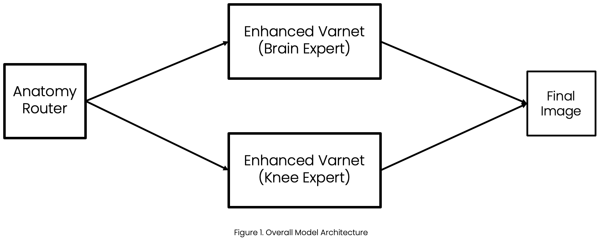

# Team Fouriersa AI

2025 SNU FastMRI Challenge  

Members:
- **Sean Park** (parksean7@snu.ac.kr, SNU ECE)   
- **Dogyu Lee** (dgyulee@snu.ac.kr, SNU ECE)  

---
## 1. Model Architecture Overview



- Our solution uses a Mixture of Experts (MoE) architecture with anatomy-specific reconstruction models.
- Each anatomy-specific reconstruction model is a Self-Adaptive-Gradient Variational Network (SAGVarNet)
- Main Model: `MoE_SAGVarNet`
  - Router: `anatomyRouter`
  - Brain Expert: `SAGVarNet`
  - Knee Expert: `SAGVarNet`
- More information in our submitted PPT and video

## 2. Directory Structure
### Overview
```
root/
├── FastMRI_challenge/    # Current Directory 
├── Data/                 # Holds the MRI data for Train / Val / Eval
└── result/               # Holds the model weights and logs
```

### result directory
```
result/
├── anatomy_classifier_cnn/
│   ├── phase_1/
│   └── phase_2/
│       └── model_epoch_1.pt       # Final CNN Classifier (10 epochs)
│
├── brain_expert/
│   ├── phase_1/
│   ├── phase_1_resume/
│   ├── phase_2/
│   ├── phase_2_resume/
│   ├── phase_3/
│   ├── phase_4/
│   └── phase_5/
│       └── model_epoch_4.pt       # Final Brain Expert (63 epochs)
│
├── knee_expert/
│   ├── phase_1/
│   ├── phase_2/
│   ├── phase_3/
│   ├── phase_4/
│   ├── phase_5/
│   └── phase_6/
│       └── model_epoch_2.pt       # Final Knee Expert (67 epochs)
│
└── final_model_moe/
        └── best_model.pt          # Final Combined Model
```

- Since we have carefully trained each model sequentially step-by-step with different configurations (e.g., different augmentation strength, loss function), each model folder  has its own train phase folder (e.g., `result/brain_expert/phase_1/`). 
- In each model train phase folder, model pt file and loss log is located.
  - `model_epoch_n.pt` 
  - `train_loss_log.npy` (when we didn't use validation)
  - `train_log.npy`, `val_log.npy` (when we used validation)
- We constructed the final model (MoE_SAGVarNet) `result/final_model_moe/best_model.pt` by combining the following three models
  - `result/anatomy_classifier_cnn/phase_2/model_epoch_1.pt`
  - `result/brain_expert/phase_5/model_epoch_4.pt`
  - `result/knee_expert/phase_6/model_epoch_2.pt`


### FastMRI_challenge directory
```
FastMRI_challenge/
├── docs/
├── run/                # Train, Test Frontend Scripts
├── run_shell/          # Shell Scripts
├── utils/
│   ├── common/         # Loss Functions
│   ├── data/           # Data Loader, Augmentor
│   ├── fastmri/
│   ├── learning/       # Train, Test Backend Scripts
│   └── model/          # SAGVarNet, anatomyRouter, MoE_SAGVarNet
├── requirements.txt
└── README.md           # This File
```
### Data directory

We haven't modified the `Data` directory

## 3. Dependencies

- If you are testing in this VESSL server, there is no need for extra installation.   
- But if you are starting fresh, run the following command.

    ```python
    pip install -r requirements.txt
    ```
- Sometimes, the VESSL environment ommits an error, even though you ran the pip instruction. Then you may also need to run these commands as well.
    ```python
    pip uninstall -y opencv-python
    pip install opencv-python-headless
    ```

## 4. Final Model Evaluation
When running all bash scripts, make sure you are in `root/FastMRI_challenge/`

### How to Reconstruct ?
```bash
sh run_shell/reconstruct.sh
```

### How to Evaluate ?
```bash
sh run_shell/leaderboard_eval.sh
```

### Our Results on Public Leaderboard Dataset

```
Category        Count    Min      Max      Mean     Std     
------------------------------------------------------------
Overall         1809     0.8247   1.0000   0.9732   0.0233  
Acc4 Brain      520      0.9714   1.0000   0.9915   0.0045  
Acc4 Knee       388      0.8247   0.9954   0.9587   0.0252  
Acc8 Brain      520      0.9538   1.0000   0.9804   0.0085  
Acc8 Knee       381      0.8470   0.9974   0.9532   0.0260  
------------------------------------------------------------

Leaderboard SSIM : 0.9732
========== Details ==========
Leaderboard SSIM (acc4): 0.9775
Leaderboard SSIM (acc8): 0.9689

```

## 5. How to Reproduce ?
- When running all bash scripts, make sure you are in `root/FastMRI_challenge/`
- Execute the following scripts one-by-one (5.1.-5.4.)
- Disclaimer
  - `anatomyClassifier_CNN` and Knee Expert (`SAGVarNet`) was trained on **VESSL iabeng48 node**
  - Brain Expert (`SAGVarNet`) was trained on **VESSL iabeng98 node**
  - In all model training scripts (`/run/train_*.py`), we used the given `seed_fix` function to guarantee reproducibility as much as possible
  - The validation loss logs match

### 5.1. anatomyClassifier_CNN for anatomyRouter
```bash
sh run_shell/train_classifier_cnn.sh
```

### 5.2. SAGVarNet as Brain Expert
```bash
sh run_shell/train_expert_brain_1.sh
sh run_shell/train_expert_brain_1_resume.sh
sh run_shell/train_expert_brain_2.sh
sh run_shell/train_expert_brain_2_resume.sh
sh run_shell/train_expert_brain_3.sh
sh run_shell/train_expert_brain_4.sh
sh run_shell/train_expert_brain_5.sh
```
**Note**: Due to VESSL environment issues and our mistake (e.g., keyboard interrupt), our training unintendedly ended preemptively in some phases.
- `train_expert_brain_1.sh` was suppose to run for 15 epochs but ended after epoch 3 (4th). We resumed the training with `run_shell/train_expert_brain_1_resume.sh`
- `train_expert_brain_2.sh` was suppose to run for 15 epochs but ended after epoch 7 (8th). TWe resumed the training with `run_shell/train_expert_brain_2_resume.sh`
- `train_expert_brain_3.sh` was suppose to run for 15 epochs but ended after epoch 12 (13th). We just moved onto the next phase.
- This is why the loss log file (`train_loss_log.npy`) in `result/brain_expert/phase_1`, `result/brain_expert/phase_2`, `result/brain_expert/phase_3` only has 4, 8, 13 entries instead of 15.

### 5.3. SAGVarNet as Knee Expert
```bash
sh run_shell/train_expert_knee_1.sh
sh run_shell/train_expert_knee_2.sh
sh run_shell/train_expert_knee_3.sh
sh run_shell/train_expert_knee_4.sh
sh run_shell/train_expert_knee_5.sh
sh run_shell/train_expert_knee_6.sh
```

### 5.4. Combine as Final Model
```bash
sh run_shell/combine.sh
```

## TL;DR
- We propose an anatomy based MoE model. We applied various augmentation for robustness.
- Run all the scripts mentioned in section 5 (How to Reproduce?)
- Then evaluate using scripts mentioned in section 4
- We thank all the TAs, Professor Lee Jongho, and all others involved. It was a fun challenge.